## 计算机毕业设计吊打导师hadoop+spark知识图谱房源推荐系统 房价预测系统 二手房推荐系统 房源数据分析 房源可视化 房源大数据大屏 大数据毕业设计 机器学习 大数据毕设 深度学习 人工智能

## 要求
### 源码有偿！一套(论文 PPT 源码+sql脚本+教程)

简易

https://www.bilibili.com/video/BV1B44y1w7yL/?spm_id_from=333.999.0.0

详细
https://www.bilibili.com/video/BV1Q14y1B7bs/?spm_id_from=333.999.0.0

### 
### 加好友前帮忙start一下，并备注github有偿美食推荐图谱
### 我的QQ号是2827724252或者798059319或者 1679232425或者微信:bysj2023nb

# 

### 加qq好友说明（被部分 网友整得心力交瘁）：
    1.加好友务必按照格式备注
    2.避免浪费各自的时间！
    3.当“客服”不容易，repo 主是体面人，不爆粗，性格好，文明人。

适合地狱级难度，从头到尾吊打导师！

干死中国这帮杂种导师！完全弱智张口喷来喷去！吃屎东西！什么鸡巴技术不会就会用嘴写代码！可操死他妈把！那就用我的项目摩擦吊打他！

# 开发技术
hadoop
spark
springboot
vue.js
Python爬虫、机器学习、深度学习
mybatis-plus
neo4j知识图谱图数据库
mysql
协同过滤算法(基于物品、基于用户模式)
MLP模型
SVD神经网络
CNN、KNN、GNN卷积神经网络预测算法
阿里云平台
百度AI平台
阿里大于短信平台
lstm模型

# 特色/创新点
1.支付宝沙箱支付
2.支付邮箱通知(JavaMail)
3.短信验证码修改密码
4.知识图谱
5.四种推荐算法(协同过滤基于用户、物品、SVD混合神经网络、MLP深度学习模型)
6.线性回归算法预测房价
7.Python爬虫采集大众点评美食数据
8.AI短信识别
9.百度地图API
10.lstm情感分析
11.spark大屏可视化

....10-50种创新点

# 运行截图

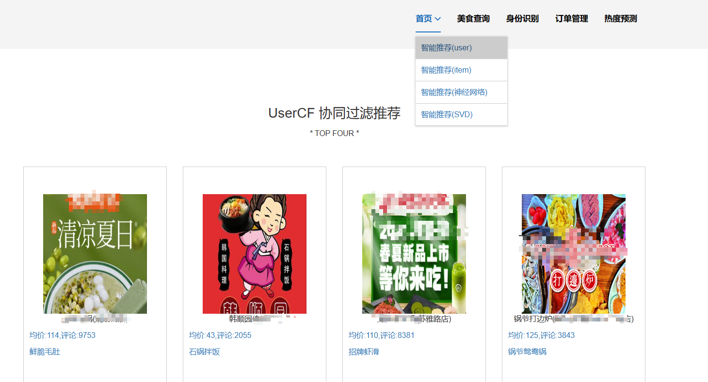
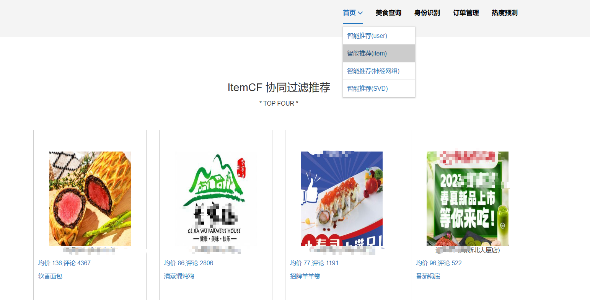
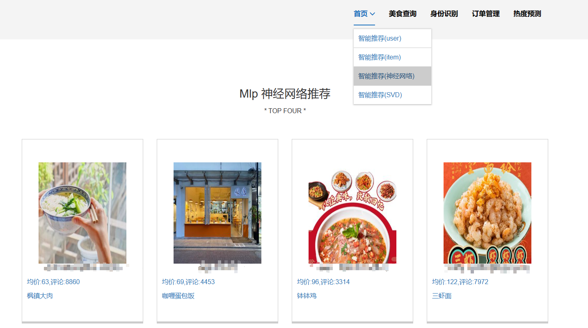
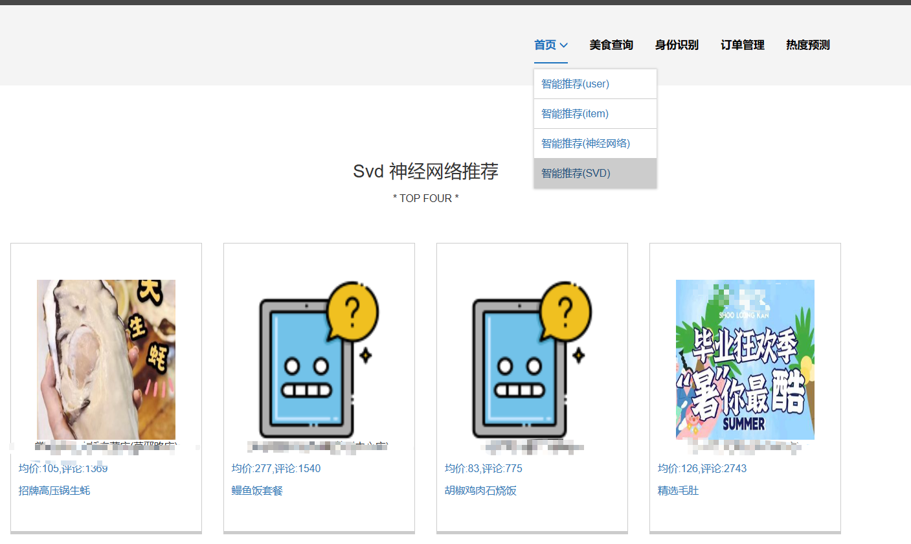
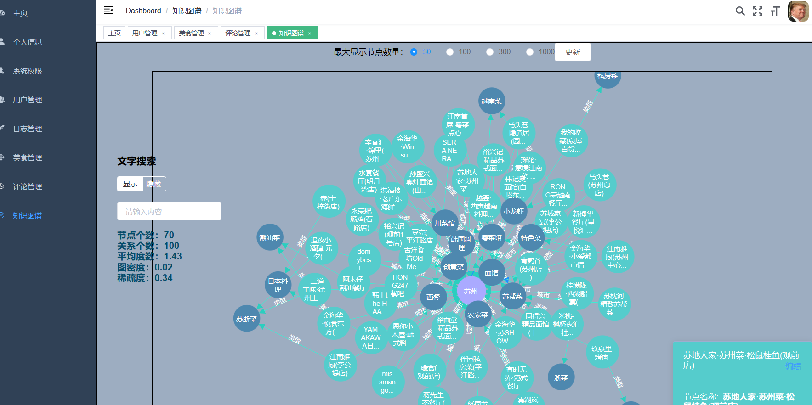

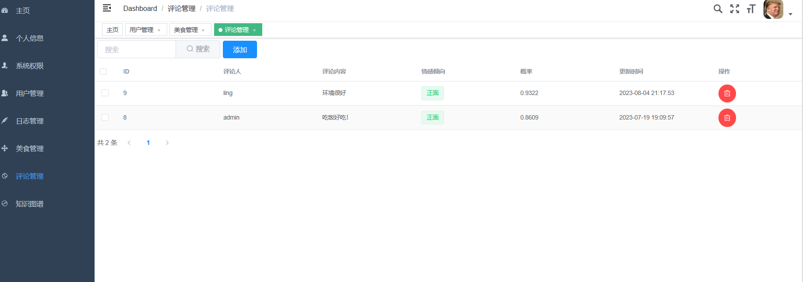
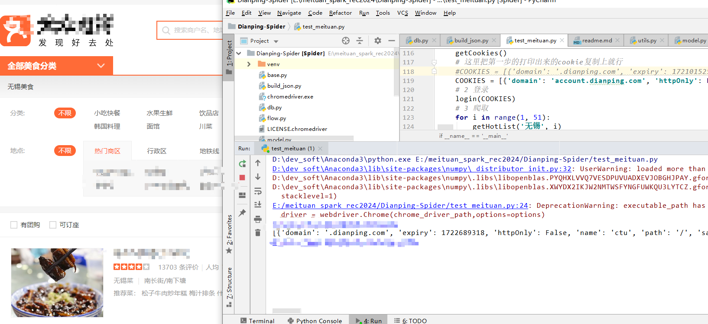
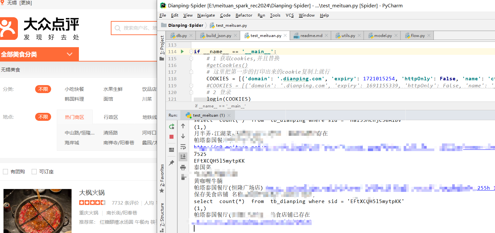
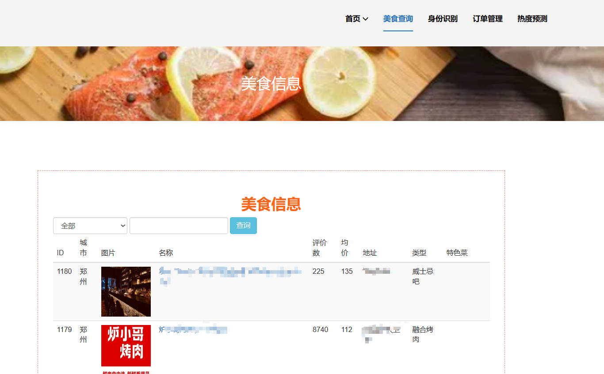
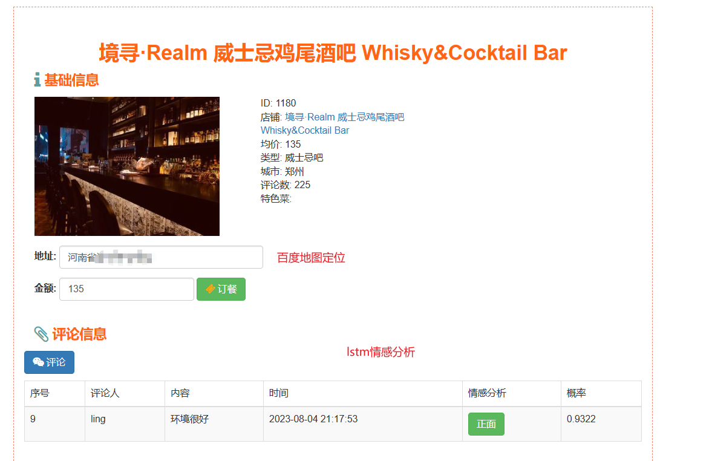
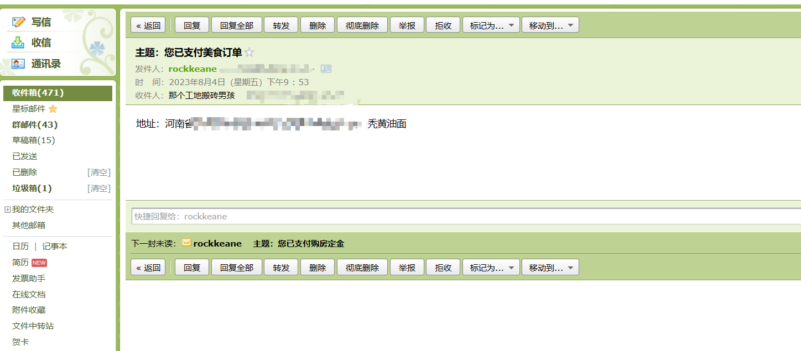
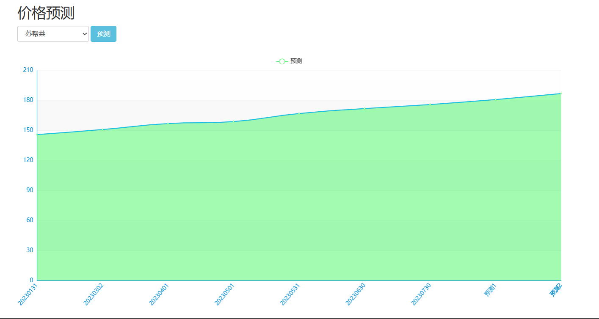
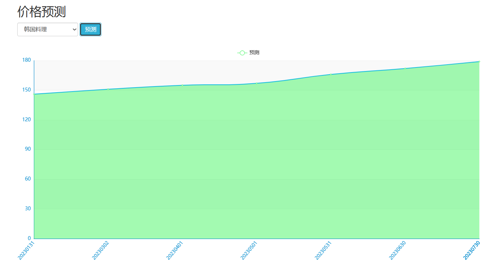
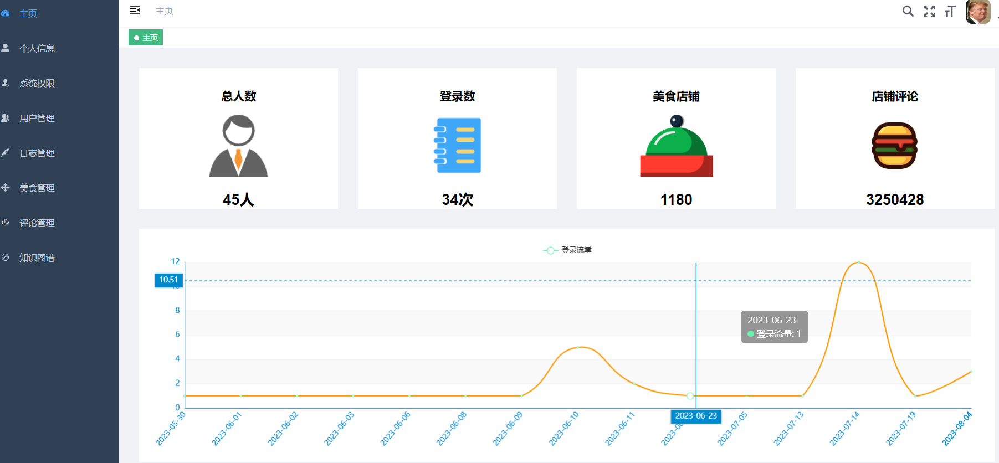
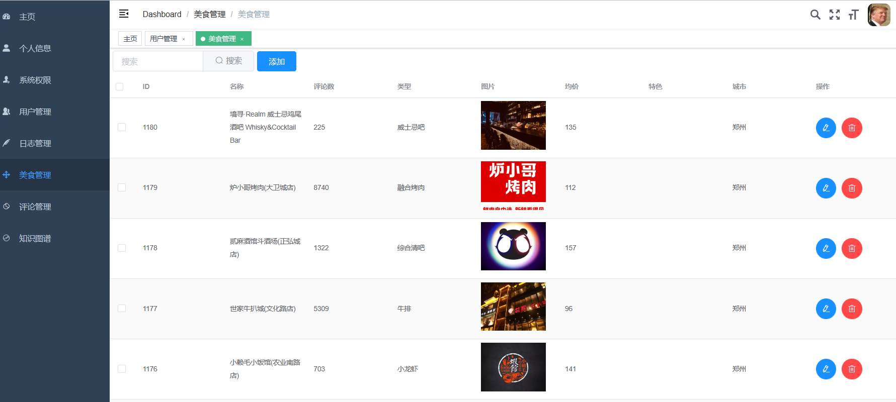
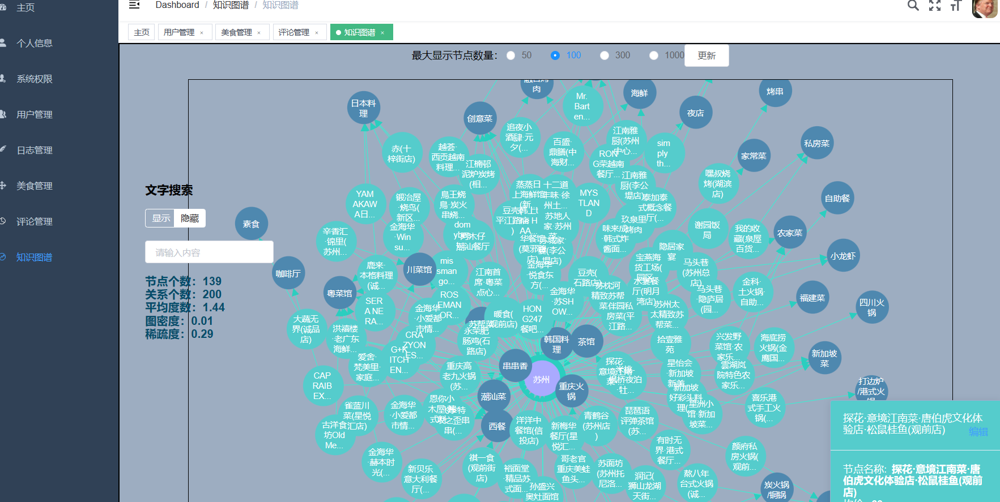
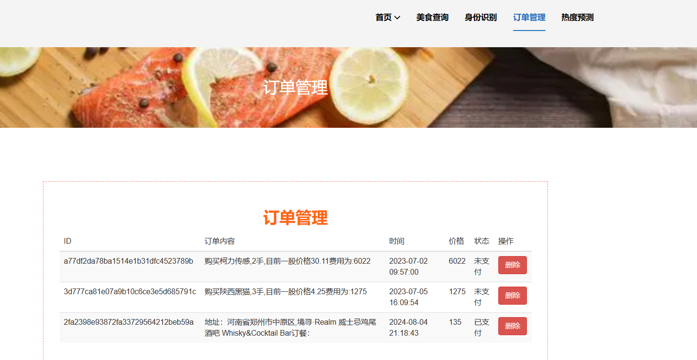

# 运行视频(B站)

简易

https://www.bilibili.com/video/BV1B44y1w7yL/?spm_id_from=333.999.0.0

详细
https://www.bilibili.com/video/BV1Q14y1B7bs/?spm_id_from=333.999.0.0

